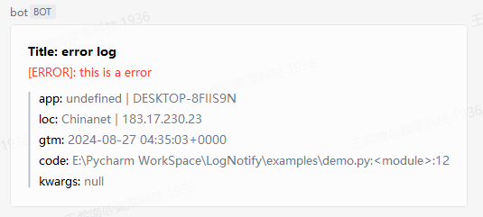

# LogNotify

---
重写Logger对象的debug、info、warning、error、exception方法，在新方法内，除了原本的日志输出，还将信息入队并由消费者处理。创建上述队列消费者线程，去发requests，上报信息。

Rewrite the debug, info, warning, error, and exception methods of the Logger object so that within the new methods, in addition to the original log output, messages are queued and processed by the consumer. Create the above queue consumer thread to go send requests and report the information.

## 安装/Install

```shell
pip install log_notify-*.*.*.tar.gz
```

## 使用/Quick start

```
import logging

from log_notify.handle import init_notify
from loguru import logger

if __name__ == '__main__':
    init_notify(logger=logger, notify_url='https://your_webhook')
    logger.error('this a error message.')
```



## 其他/Other

- 打包/Package
    ```shell
    python setup.py sdist
    ```